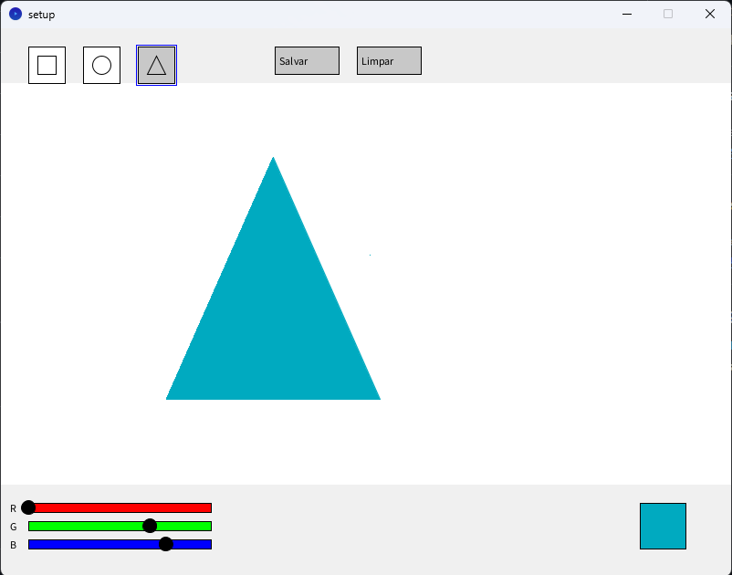

# 🎨 Processing Formas

Um editor gráfico interativo desenvolvido em Processing para criação de arte digital com formas geométricas.

 <!-- Adicione uma screenshot ou GIF -->

## ✨ Funcionalidades

- **Desenho de formas básicas**
  - Quadrados
  - Círculos
  - Triângulos
- **Controles de cor RGB** através de sliders
- **Preenchimento inteligente** com duplo clique
- **Sistema de salvamento** automático com timestamp
- **Interface intuitiva** com área de desenho delimitada
- **Modo de pré-visualização** em tempo real

## 🖥️ Como Usar

1. **Selecione uma forma** clicando nos botões da barra superior
2. **Ajuste as cores** usando os sliders RGB na parte inferior
3. **Desenhe** clicando e arrastando na área central
4. **Preencha formas** com duplo clique rápido (500ms)
5. **Salve sua arte** com o botão "Salvar"
6. **Reinicie** a qualquer momento com o botão "Limpar"

## ⚙️ Instalação

1. Tenha o [Processing](https://processing.org/download/) instalado (versão 4.0+)
2. Clone o repositório:
   ```bash
   git clone https://github.com/seu-usuario/nome-do-repositorio.git
   ```
3. Abra o arquivo `setup.pde` no Processing IDE
4. Execute o sketch (botão ▶️)

## 🤝 Contribuindo

1. Reporte issues aqui
2. Faça um fork do projeto
3. Crie sua branch (`git checkout -b feature/nova-funcionalidade`)
4. Commit suas mudanças (`git commit -m 'Adiciona nova funcionalidade'`)
5. Push para a branch (`git push origin feature/nova-funcionalidade`)
6. Abra um Pull Request`

## 📄 Licença

Este projeto está licenciado sob a Licença MIT.

Desenvolvido com ❤️ por Carla Reis
